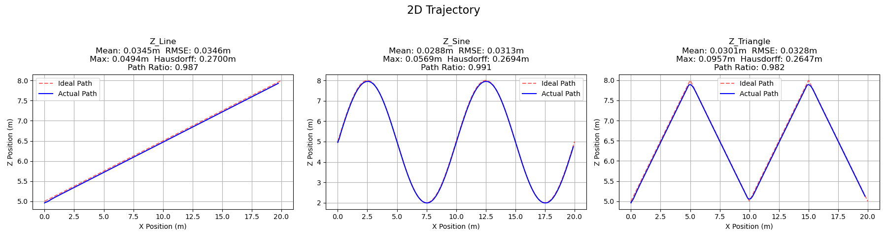
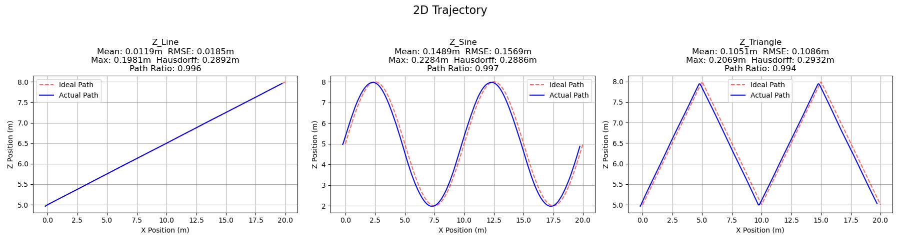
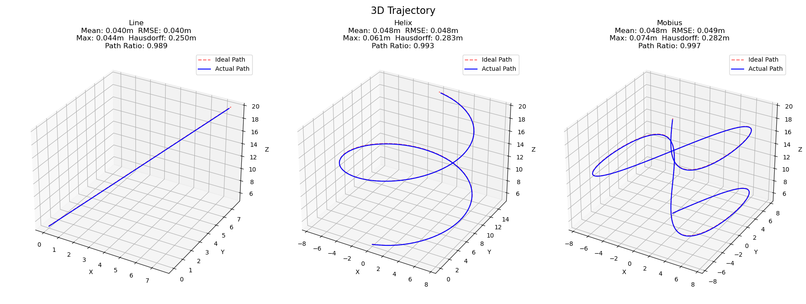
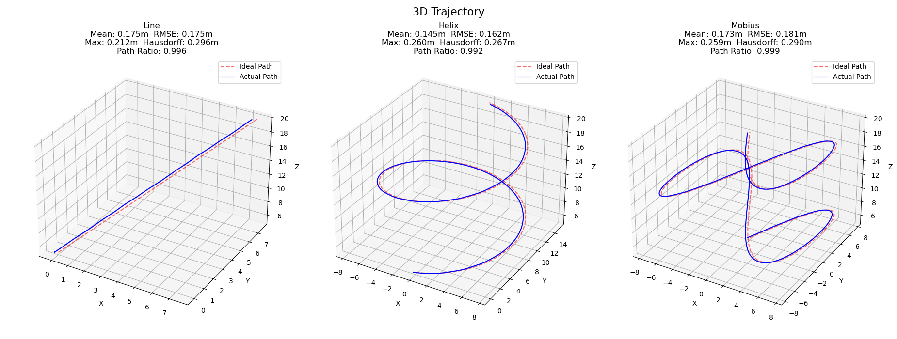

# Mobile Robot - LAB2: Control


*By Jirattanun Leeudomwong & Bharuj Aursudkit*  


---

## Overview

This lab implements control method for a quadcopter simulation in ROS2 with Gazebo. The drone is made to:

1. Hover stably at a fixed position and orientation (Part 1)
2. Follow 2D trajectories in the x–z plane (Part 2)
3. Follow 3D trajectories through full 3D space (Part 3)

All behaviors are tested in two environments — calm air and a 4 m/s crosswind in the `-y` direction.

---

## Development Environment

- ROS2
- Gazebo
- C++
- Python
- MATLAB

---

## Quadcopter Specification

| Parameter | Symbol | Value |
|---|---|---|
| Mass | *m* | 1.5 kg |
| Motor thrust coefficient | *K_F* | 8.54858 × 10⁻⁶ |
| Motor drag coefficient | *K_m* | 8.06428 × 10⁻⁵ |
| Gravitational acceleration | *g* | 9.81 m/s² |
| Moment of inertia (roll) | *I_xx* | 0.0347563 kg·m² |
| Moment of inertia (pitch) | *I_yy* | 0.07 kg·m² |
| Moment of inertia (yaw) | *I_zz* | 0.0977 kg·m² |

**Rotor layout (top view):**

```
         0.20m  0.20m 
           ↓      ↓
Motor 3 ●─────=──────● Motor 1
              │ <- 0.13m
              0
              │ <- 0.13m
Motor 0 ●─────=──────● Motor 2
           ↑      ↑
         0.22m  0.22m 

              ↓ Front
```

---

## System Architecture

```
    Reference (quad_trajectory)
        │  [12×1 state vector] <────── +/- ────────|
        ▼                                          |
   Controller (LQR)                                |
        │  [T, τ_φ, τ_θ, τ_ψ]                      |
        ▼                                          |
   Motor Mixing                                    |
        │  [F0, F1, F2, F3]                        |
        ▼                                          |
  Quadcopter Dynamics (Gazebo)                     |
        │                                          |
        ▼                                          |
     Output                                        |
        │                  (feedback)              |
        |──────────────────────────────────────────|
        ▼
[x, y, z, ẋ, ẏ, ż, φ, θ, ψ, φ̇, θ̇, ψ̇]
```

The trajectory nodes used three-phase state machine:
`HOVER_START → TRAJECTORY → HOVER_END`

---

## Quadcopter System Modeling

### Quadcopter dynamics model

Using Newton's laws (translational) and Euler's laws (rotational):

```
ẍ = (T/m)(cosφ sinθ cosψ + sinφ sinψ)
ÿ = (T/m)(cosφ sinθ sinψ − sinφ cosψ)
z̈ = (T/m)(cosφ cosθ) − g

φ̈ = τ_φ/I_xx + θ̇ψ̇((I_yy − I_zz)/I_xx)
θ̈ = τ_θ/I_yy + φ̇ψ̇((I_zz − I_xx)/I_yy)
ψ̈ = τ_ψ/I_zz + φ̇θ̇((I_xx − I_yy)/I_zz)
```

---

### Motor Mixing

Individual motor forces are derived by inverting the mixing matrix:

```
[F0]   [  1     1     1     1   ]⁻¹  [T  ]
[F1] = [-d_yr  d_yrl d_yl -d_yrr]    [τ_φ]
[F2]   [-d_xf  d_xr -d_xf  d_xr ]    [τ_θ]
[F3]   [ -km   -km    km    km  ]    [τ_ψ]
```

Each propeller thrust: `F_i = K_F · ω_i²`

---

## Controllers

### Linearised Model (for LQR)

Linearised around the hover equilibrium point:

```
ẍ ≈ gθ        φ̈ ≈ τ_φ / I_xx
ÿ ≈ −gφ       θ̈ ≈ τ_θ / I_yy
z̈ ≈ T/m − g   ψ̈ ≈ τ_ψ / I_zz
```

**State vector:** `X = [x, y, z, ẋ, ẏ, ż, φ, θ, ψ, φ̇, θ̇, ψ̇]ᵀ` (12×1)  
**Control input:** `U = [T, τ_φ, τ_θ, τ_ψ]ᵀ` (4×1)

---

### LQR (Linear Quadratic Regulator)

The gain matrix **K** (4×12) is computed by solving the Algebraic Riccati Equation:

```
AᵀP + PA − PBR⁻¹BᵀP + Q = 0,   K = R⁻¹BᵀP
```

Cost matrices used:

```matlab
Q = diag([30, 30, 30,   % position
           5,  5,  5,   % velocity
           1,  1,  2,   % attitude
           0.1, 0.1, 0.1])

R = diag([1, 2, 2, 2])  % [T, τ_x, τ_y, τ_z]
```

---

## Trajectories

### 2D (x–z plane, progressing in +x)

| Trajectory |
|---|
| Line |
| Sine Wave |
| Triangle Wave |

### 3D (full space, progressing along z)

| Trajectory |
|---|
| Line |
| Helix |
| Möbius |

---

## Results

### 2D Trajectories

| Trajectory | Condition | Mean Error (m) | RMSE (m) | Max Error (m) | Hausdorff (m) | Path Ratio |
|---|---|---|---|---|---|---|
| Line | No Wind | 0.0345 | 0.0346 | 0.0494 | 0.2700 | 0.987 |
| Sine Wave | No Wind | 0.0288 | 0.0313 | 0.0569 | 0.2694 | 0.991 |
| Zriangle Wave | No Wind | 0.0301 | 0.0328 | 0.0957 | 0.2647 | 0.982 |
| Line | Wind | 0.0119 | 0.0185 | 0.1981 | 0.2892 | 0.996 |
| Sine Wave | Wind | 0.1489 | 0.1569 | 0.2284 | 0.2886 | 0.997 |
| Triangle Wave | Wind | 0.1051 | 0.1086 | 0.2069 | 0.2932 | 0.994 |

#### 2D Trajectory with no wind

#### 2D Trajectory with wind


### 3D Trajectories

| Trajectory | Condition | Mean Error (m) | RMSE (m) | Max Error (m) | Hausdorff (m) | Path Ratio |
|---|---|---|---|---|---|---|
| Line | No Wind | 0.040 | 0.040 | 0.044 | 0.250 | 0.989 |
| Helix | No Wind | 0.048 | 0.048 | 0.061 | 0.283 | 0.993 |
| Mobius | No Wind | 0.048 | 0.049 | 0.074 | 0.282 | 0.997 |
| Line | Wind | 0.175 | 0.175 | 0.212 | 0.296 | 0.996 |
| Helix | Wind | 0.145 | 0.162 | 0.260 | 0.267 | 0.992 |
| Mobius | Wind | 0.173 | 0.181 | 0.259 | 0.290 | 0.999 |

#### 3D Trajectory with no wind

#### 3D Trajectory with wind
